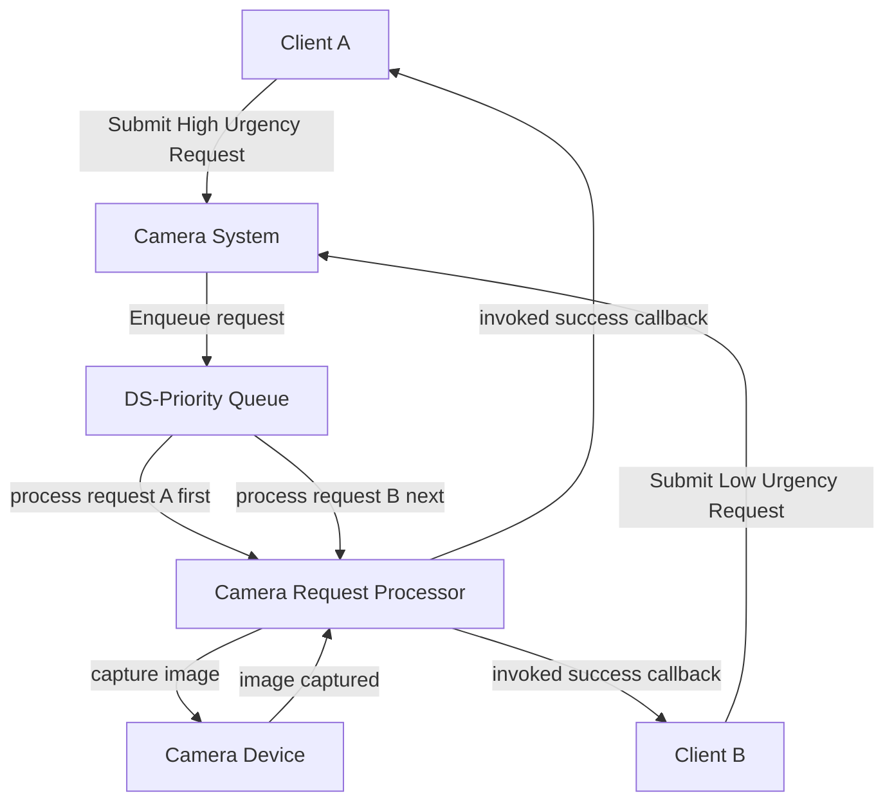

# HLD_LLD_N
HLD+LLD Design Task

1.  design of the camera-system with the camera-system needs to be done
2.  the camera-system should remain abstracted without any specific logic
3.  the camera-system should adhere to all the requirements mentioned above
4.  design an HLD ⇒ the design document should contain
      1.  responsibility of each block used in the HLD
      2.  use-case diagram explaining the logical flow of events that happen when two requests with different urgency levels are concurrently submitted to the camera-system
5.  design an LLD ⇒ the design document should contain
      1.  proper classes/interfaces ready to be implemented
      2.  use-case diagram explaining the logical flow of events that happen when two requests with different urgency levels are concurrently submitted to the camera-system

## High Level Design
### Responsibility of each block used in the HLD
1.  Client
    - Submit capture request to Camera System
    - Submit success/fail callbacks
    - Set Urgency level to individual request
2.  Camera System
    - Accept multiple capture requests concurrently
    - Accept urgency level
    - Trigger callback based on:
        - Success Capture
        - Failure Capture
3.  Camera Request Processor
    - Manage all the incoming requests
    - Play the role of orchestrator between Camera System & Camera Device
    - Use the data-structure logic
    - Orchestrator and prioterize request based on Urgency level from Client
4.  Data Structure for storing requests:
    - We will use the priority Queue to store urgency level
    - Serve the request based on Higher/lower urgency
5.  Camera Device (actual camera):
    - Device which will actually capture image to process

### Use-case diagram explaining the logical flow:



## Low Level Design
### proper classes/interfaces ready to be implemented
1. Client: For handling success/failure of capture
    ```
    interface Client{
        void onSuccess(Image image);
        void onFailure(String errorMessage);
    }
    ```
2. Camera System: Hold the data structure of Priority Queue
    ```
    class CameraSystem{
        PriorityQueue<Request> pq= new PriorityQueue<>();
        void submitRequest(Request request);
    }
    ```
3. Camera Request processor: Encapsulation of Request Detail and client-related information
    ```
    class Request implements Comparable<Request>{
        URGENCY urgency;
        Client client;
        void trigger();
    }
    
    class RequestProcessor implements Runnable {
        CameraSystem cameraSystem;
        void run();
    }
    ```
4. Priority Queue: Manages the request based on Urgency Level
    ```
    class PriorityQueue<T>{
        void addRequest(T request);
        T poll();
    }
    ```
5. Camera Device: Actual Camera which click the image 
    ```
    class CameraDervice{
        Image invokeCapture();
    }
    
    ```
### Use-case diagram explaining the logical flow of events 
```mermaid
classDiagram
    class Client {
        +void onSuccess(Image image)
        +void onFailure(String errorMessage)
    }
   
    class CameraSystem {
        -PriorityQueue<Request> pq= new PriorityQueue<>()
        +void submitRequest(Request request);
    }
   
    class Request {
        +URGENCY urgency
        +Client client
        +void trigger()
    }
   
    class RequestProcessor {
        -CameraSystem cameraSystem
        +void run()
    }
   
    class PriorityQueue~T~ {
        +void addRequest(T request);
        +T poll();
    }
   
    class CameraDervice {
        + Image invokeCapture()
    }
   
    Client <|-- Request
    CameraSystem "1" *-- "1" PriorityQueue
    PriorityQueue <|-- Request
    RequestProcessor <|-- Request
    RequestProcessor "1" *-- "1" CameraSystem
    RequestProcessor --> CameraDervice

    


